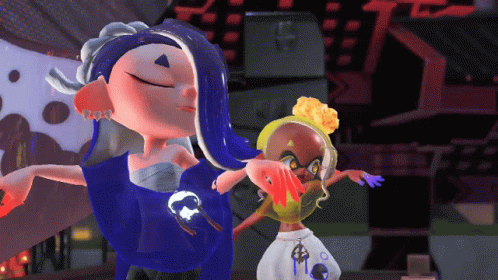

<div align="center">
  
</div>

<h2 align="center">💬 ◄ 𝓐𝓫𝓸𝓾𝓽 𝓶𝓮 ► 💬</h2>
<!---->

<p>I'm a <ins>21-year-old passionate developer</ins> from <ins>France</ins> 🇫🇷.<br />
🎓 Graduated with a B.U.T. in Computer Science.<br />
🚀 Currently pursuing a Master's-level degree in Software Architecture & Development.
</p>


<picture>
  <source media="(prefers-color-scheme: dark)" srcset="assets/icons_dark.svg" />
  <source media="(prefers-color-scheme: light)" srcset="assets/icons.svg" />
  
</picture>

<br />



**✨ <ins>My hobbies</ins>**
- ⌨️ IT development 
- 👨‍💻 Reverse engineering
- 🐛 Bug researcher
- 👀 Watching anime
- 🎮 Gaming addict
- 🔫 Undisputed fan of Splatoon 3
- 🎢 Theme Park & Coaster Enthusiast

<br /><br />

<h2 align="center">🧪 ◄ 𝓒𝓾𝓻𝓻𝓮𝓷𝓽 𝓔𝔁𝓹𝓵𝓸𝓻𝓪𝓽𝓲𝓸𝓷𝓼 & 𝓡&𝓓 ► 🧪</h2>
<p align="center"><i>Upgrading my stack, prototyping, and waiting for the right moments...</i></p>

<table align="center" width="100%">
  <tr>
    <td width="50%" valign="top">
      <h3>🥽 VR Integrations</h3>
      <p>Prototyping logic for SteamVR overlays and background services.</p>
      <p><i>Tech stack: C# • .NET • SteamVR API</i></p>
    </td>
    <td width="50%" valign="top">
      <h3>⚙️ Hardware & Embedded</h3>
      <p>Researching firmware architectures for custom controller emulation via Web Serial.</p>
      <p><i>Tech stack: ESP32-S3 • C++</i></p>
    </td>
  </tr>
  <tr>
    <td width="50%" valign="top">
      <h3>🧰 TPI Toolbox (Standby for V2)</h3>
      <p>V1 is archived due to game dev halting. Holding the line to build brand-new QoL Tampermonkey scripts when V2 drops!</p>
      <p><i>Focus: TypeScript • Vite • Userscript</i></p>
    </td>
    <td width="50%" valign="top">
      <h3>🐳 Self-Hosting & DevOps</h3>
      <p>Architecting and maintaining my own Linux infrastructure for side projects.</p>
      <p><i>Stack: Podman • Traefik • CI/CD</i></p>
    </td>
  </tr>
  <tr>
    <td colspan="2" valign="top" align="center">
      <h3>🤫 [REDACTED] Side Quests</h3>
      <p>My brain constantly runs background threads with random concepts. Expect sudden repository spawns and spontaneous commits without warning.</p>
      <p><i>Dependencies: Hot Chocolate • Curiosity • Late Night Motivation</i></p>
    </td>
  </tr>
</table>

<br />
<h2 align="center">⚡ ◄ 𝓡𝓮𝓬𝓮𝓷𝓽 𝓐𝓬𝓽𝓲𝓿𝓲𝓽𝔂 ► ⚡</h2>

<!--START_SECTION:activity-->
1. 🎉 Merged PR [#3](https://github.com/TyradexTeam/Website/pull/3) in [TyradexTeam/Website](https://github.com/TyradexTeam/Website)
2. 💪 Opened PR [#3](https://github.com/TyradexTeam/Website/pull/3) in [TyradexTeam/Website](https://github.com/TyradexTeam/Website)
3. 💪 Opened PR [#120](https://github.com/Yarkis01/TPI_Toolbox/pull/120) in [Yarkis01/TPI_Toolbox](https://github.com/Yarkis01/TPI_Toolbox)
<!--END_SECTION:activity-->

<br />
<h2 align="center">📊 ◄ 𝓦𝓪𝓴𝓪𝓽𝓲𝓶𝓮 ► 📊</h2>

<!--START_SECTION:waka-->

```txt
Total Time: 1,180 hrs 21 mins

C#                                 351 hrs 50 mins       ⣿⣿⣿⣿⣿⣿⣿⣦⣀⣀⣀⣀⣀⣀⣀⣀⣀⣀⣀⣀⣀⣀⣀⣀⣀   29.81 %
Markdown                           166 hrs 39 mins       ⣿⣿⣿⣦⣀⣀⣀⣀⣀⣀⣀⣀⣀⣀⣀⣀⣀⣀⣀⣀⣀⣀⣀⣀⣀   14.12 %
Python                             148 hrs 31 mins       ⣿⣿⣿⣄⣀⣀⣀⣀⣀⣀⣀⣀⣀⣀⣀⣀⣀⣀⣀⣀⣀⣀⣀⣀⣀   12.58 %
PHP                                76 hrs 23 mins        ⣿⣶⣀⣀⣀⣀⣀⣀⣀⣀⣀⣀⣀⣀⣀⣀⣀⣀⣀⣀⣀⣀⣀⣀⣀   06.47 %
Binary                             55 hrs 47 mins        ⣿⣄⣀⣀⣀⣀⣀⣀⣀⣀⣀⣀⣀⣀⣀⣀⣀⣀⣀⣀⣀⣀⣀⣀⣀   04.73 %
```

<!--END_SECTION:waka-->

<br />

<div align="center">
  <h2 align="center">🏅 ◄ 𝓐𝓬𝓱𝓲𝓮𝓿𝓮𝓶𝓮𝓷𝓽𝓼 ► 🏅</h2>
  <table align="center" width="100%">
    <tr>
      <td width="50%" align="center" valign="top">
        <h3>🎢 Coaster Count</h3>
        <a href="https://coaster-count.com/user/66449/ridden" target="_blank">
          
        </a>
      </td>
      <td width="50%" align="center" valign="top">
        <h3>🏆 Trophies</h3>
        
      </td>
    </tr>
  </table>
</div>
